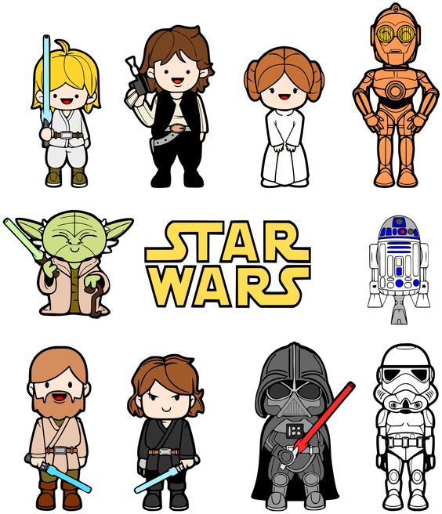

## The NFL's parity paradox { .white }


<p class="white">
Michael Lopez, Gregory Matthews, Benjamin Baumer
https://github.com/bigfour/competitiveness.
</p>

## Goals: the NFL's

> There are systems that we have to make sure that we maintain (parity).

> Carefully constructed system of competitive balance that makes NFL games and championship races so unpredictable and exciting.

**Roger Goodell, NFL commisioner**


> If you expect something to happen in this league, 
> it’s likely not going to happen. 

**Jonathan Kraft, President of New England Patriots**


## Goals: ours

1. Develop model to assess parity in professional sports
2. Does the NFL have parity?
3. How do NFL *systems* impact league outcomes? 


## 1. Assess parity in professional sports

How to define parity

> the state or condition of being equal

**Google**


## 1. Assess parity in professional sports

What parity looks like:


## 1. Assess parity in professional sports

What parity does not look like: 


## 1. Assess parity in professional sports

Parity checklist

1. Equality at a fixed time 
2. Within season equality 
3. Between season equality

## Building a cross-sport model 


Motivation: State space model of [Glickman and Stern, 1998](http://www.tandfonline.com/doi/abs/10.1080/01621459.1998.10474084)


## Building a cross-sport model

* $p_{(q,s,k)ij}$ is probability that team $i$ will beat team $j$ in season $s$ during week $k$ of sports league $q$, for $q \in \{MLB, NBA, NFL, NHL\}$.
* $\alpha_{q_{0}}$ be the league-wide home advantage (HA) in $q$
* $\alpha_{(q) i^{\star}}$ be the extra effect (+ or -) for team $i$ when playing at home
* $\theta_{(q,s,k) i}$ and $\theta_{(q, s, k) j}$ be season-week team strength parameters 


## Building a cross-sport model

\[ E[\text{logit}(p_{(q,s,k) ij})] = \theta_{(q,s,k) i} - \theta_{(q, s, k) j} + \alpha_{q_0} + \alpha_{(q) i^{\star}} \] 

Assumptions: 

1. $\sum_{i=1}^{t_{q}} \theta_{(q,s,k)i} = 0$
1. $E[\theta_{(i,q,s+1,1)}] = \gamma_{q, season} \theta_{(i, q,s,k)}$
1. $E[\theta_{(i,q,s,k+1)}] = \gamma_{q, week} \theta_{(i, q,s,k)}$
1. $\gamma_{q,week}$ and $\gamma_{q,season}$ week/season level autogressive parameters


## Fitting a cross-sport model

*Data*:  2006-2016 regular season games in MLB, NBA, NFL, NHL via Sports Insights

*Priors*: Uniform (variance parameters) and Normal (team strength parameters)

*Software*: `rjags` package in **R** statistical software 

*Draws*: 20k iterations, 2k burn in, thin of 5

## Team strength results

```{r, echo = FALSE, message = FALSE, warning = FALSE, fig.width= 6, fig.height = 3.5}
source("https://raw.githubusercontent.com/bigfour/competitiveness/master/config.R")
load(file.path(root, "data", "tidy_thetas.rda"))
tidy_thetas <- tidy_thetas %>%
  mutate(sport = toupper(sport),
         annotation = "",
         annotation = ifelse(theta == max(theta) & sport == "NFL", 
                             paste0("Strongest (", "Patriots", ")"), 
                             annotation),
         annotation = ifelse(theta < -1.56 & sport == "NFL", 
                             paste0("Weakest (", "Jags", ")"), 
                             annotation))
colors <- tidy_thetas %>%
  select(name, primary, secondary) %>%
  unique()
primary <- colors$primary
secondary <- colors$secondary
names(primary) <- colors$name
names(secondary) <- colors$name
library(teamcolors); library(ggthemes); library(stringi); library(forcats)

###### Football only
div <- c("AFC East", "AFC West", "AFC North", "AFC South", 
         "NFC East", "NFC West", "NFC North", "NFC South")
div.teams.NFL <- c(div[6], div[8], div[3], div[1], div[8], 
               div[3], div[3], div[5], div[7], div[2],
               div[7], div[7], div[4], div[4], div[4],
               div[2], div[6], div[1], div[7], div[1], div[8],
               div[5], div[1], div[2], div[5], div[3], 
               div[2], div[6], div[6],  div[8], 
               div[4], div[5])
divisions_nfl <- data_frame(sport = "nfl", division = div.teams.NFL)
divisions_nfl$team <- teamcolors %>%
  filter(sport == "nfl") %>%
  select(name) %>%
  unlist()

divisions <- divisions_nfl
teamcolors <- teamcolors %>%
  left_join(divisions, by = c("sport" = "sport", "name" = "team"))
tidy_thetas_division <- tidy_thetas %>%
  left_join(select(teamcolors, name, division), by = c("name" = "name")) %>%
  mutate(time_val = ifelse(sport == "NFL" | sport == "MLB",  time_val + 1, time_val))
max.theta <- round(max(tidy_thetas_division$theta), 2)
min.theta <- round(min(tidy_thetas_division$theta), 2)
ggplot(data = filter(tidy_thetas_division, division == "AFC North", season == 9), 
       aes(x = week, y = theta, 
           color = name, fill = name)) +
  geom_line(alpha = 0.5) + 
  geom_point(shape = 21, size = 0.5, alpha = 0.8) + 
  geom_text(aes(label = annotation), color = "black", hjust = "left", nudge_x = 0.25) + 
  scale_color_manual(name = NULL, values = primary) + 
  scale_fill_manual(name = NULL, values = secondary) + 
  scale_x_continuous(name = "Week", breaks = c(4, 8, 12, 16)) +
  scale_y_continuous(name = "Team Strength (log-odds scale)") + 
  guides(color = FALSE, fill = FALSE) +
  guides(color = guide_legend(ncol = 1)) +
  theme_grey(base_size = 14) + 
  labs(title = "Team strengths, 2014 season")
```


## Team strength results

```{r, echo = FALSE, message = FALSE, warning = FALSE, fig.width= 6, fig.height = 3.5}
ravens.time <- tidy_thetas_division %>% filter(sport == "NFL") %>% mutate(ravens = name == "Baltimore Ravens")
ravens <- ravens.time %>% filter(ravens)
ggplot(data = ravens.time, aes(x = time_val, y = theta, fill = name)) +
  geom_line(alpha = 0.5, colour = "grey") +    
  geom_point(size = 0.5, alpha = 0.8, colour = "grey") + 
  geom_text(aes(label = annotation), color = "black", hjust = "left", nudge_x = 0.25, size = 4) + 
  geom_line(data = ravens, aes(x = time_val, y = theta), alpha = 0.5, colour = "purple") +    
  geom_point(data = ravens, aes(x = time_val, y = theta), alpha = 0.8, colour = "purple") + 
  scale_x_continuous(name = "Week", breaks = c(2006, 2008, 2010, 2012, 2014, 2016)) +
  scale_y_continuous(name = "Team Strength (log-odds scale)") + 
  guides(color = FALSE, fill = FALSE) +
  #guides(color = guide_legend(ncol = 1)) +
  theme_grey(base_size = 14) + 
  labs(title = "Ravens team strength over time")
```

## { .fullpage }

<div class="fullpage width">
```{r, echo = FALSE}
spag <- ggplot(data = tidy_thetas_division, 
       aes(x = time_val, y = theta,  group = name)) +
  geom_line(alpha = 0.5) + 
  geom_point(shape = 21, size = 0.5, alpha = 0.8) + 
  #geom_text(aes(label = annotation), color = "black", hjust = "left", nudge_x = 0.25) + 
  #scale_color_manual(name = NULL, values = primary) + 
  #scale_fill_manual(name = NULL, values = secondary) + 
  scale_x_continuous(name = "Season", breaks = 2005:2016) +
  scale_y_continuous(name = "Team Strength (log-odds scale)") + 
  guides(color = FALSE, fill = FALSE) +
  #  guides(color = guide_legend(ncol = 2)) 
  theme_grey(14) + 
  ggtitle("Team strengths across 4 sports leagues")
spag + facet_wrap(~sport, ncol = 1)
```
</div>

## 2. NFL's parity: equivalence of teams at fixed point in time


How often does the best team win?


## 2. NFL's parity: evolution of strength over time

```{r, echo = FALSE, fig.width = 5.8, fig.height = 4.4}
load(file.path(root, "data", "params.R1.rda"))
p.gamma <- ggplot(params, aes(x = gamma_w, y = gamma_s, color = toupper(sport))) + 
  geom_vline(xintercept = 1, color = "darkgray", linetype = 2) + 
  annotate("text", x = 1.001, y = 0.85, 
           label = "Random\nWalk", hjust = "left") + 
  geom_density_2d() + geom_point(alpha = 0.1) + 
  xlab(expression(paste("Week-to-week consistency (", gamma[week],")")))+ 
  ylab(expression(paste("Season-to-season consistency (", gamma[season],")")))+ 
  scale_colour_brewer(palette = "Dark2", "League") + 
  theme_grey(base_size = 14) 
p.gamma
```


## 2. NFL's parity: evolution of strength over time

<div class="double">
<p class="double-flow">
```{r, echo = FALSE, fig.height = 4.4, fig.width = 4}
p.gamma <- ggplot(params, aes(x = gamma_w, y = gamma_s, color = toupper(sport))) + 
  geom_vline(xintercept = 1, color = "darkgray", linetype = 2) + 
  geom_density_2d() + geom_point(alpha = 0.1) + 
  xlab(expression(paste("Week-to-week consistency (", gamma[week],")")))+ 
  ylab(expression(paste("Season-to-season consistency (", gamma[season],")")))+ 
  scale_colour_brewer(palette = "Dark2", "League") + 
  theme_grey(base_size = 12) 
p.gamma
```
</p><p class="double-flow">
* NFL matches NBA with low week-to-week consistency
* NFL with highest season-to-season consistency
</p>
</div>

## 2. NFL's parity 

Parity checklist

> 1. Equality at a fixed time `r emo::ji("x")`
> 2. Within season equality `r emo::ji("heavy_check_mark")`
> 3. Between season equality `r emo::ji("x")`


## 3. NFL league characteristics that impact perceived parity


> * Small number of games in a season (for a different day)
> * Single elimination tournament (for a different day)
> * Unbalanced schedule 

## 3. NFLs unbalanced schedule

Decsribe NFL schedule here

## 3. NFLs unbalanced schedule

```{r, echo = FALSE, fig.width = 6.7, fig.height = 4.4}
load(file.path(root, "data", "nflparity.rda"))

### Crossover games
nfl.crossovers <- nfl.all %>% 
  filter(type == "crossover") %>% 
  group_by(team, season, type, lag.place.div) %>% 
  summarise(exp.wins = mean(exp.win.diff)*2) 

nfl.crossovers.sum <- nfl.crossovers %>% 
  ungroup() %>% 
  group_by(team) %>% 
  summarise(total.cost = round(sum(exp.wins), 2)) 

nfl.crossovers <- nfl.crossovers %>% left_join(nfl.crossovers.sum) %>% 
  mutate(nickname = stri_extract_last_words(team), 
         team.paste = paste0(nickname, " (", round(total.cost, 2), ")"))
# It's recommended to use a named vector
cols <- c("4" = "royalblue4", "3" = "skyblue1", "2" = "pink", "1" = "red")

#nfl.crossovers %>% group_by(lag.place.div) %>% summarise(delta = mean(exp.wins))


ggplot(filter(nfl.crossovers, team == "Indianapolis Colts"), aes(season, exp.wins)) + 
  geom_bar(stat = "identity") + 
  #geom_text(data = nfl.crossovers.sum, aes(2010, -0.4, label = total.cost)) + 
  #facet_wrap(~reorder(team.paste, total.cost), nrow = 4) +
  theme_tufte(14) +
  #scale_fill_manual(values = cols, "Prior division finish", labels = c("1st", "2nd", "3rd", "4th")) +   
  ggtitle("Change in expected wins by season, Colts crossover games") + 
  xlab("") + ylab("")

```


## 3. NFLs unbalanced schedule

```{r, echo = FALSE, fig.width = 8.6, fig.height = 4.4}
ggplot(filter(nfl.crossovers, team == "Indianapolis Colts"), aes(season, exp.wins, 
           fill = factor(lag.place.div))) + geom_bar(stat = "identity") + 
  #geom_text(data = nfl.crossovers.sum, aes(2010, -0.4, label = total.cost)) + 
  #facet_wrap(~reorder(team.paste, total.cost), nrow = 4) +
  theme_tufte(14) +
  scale_fill_manual(values = cols, "Prior division finish", labels = c("1st", "2nd", "4th")) +     
  ggtitle("Change in expected wins by season, Colts crossover games") + 
  ylab("") + xlab("")

```


## { .fullpage }

<div class="fullpage width">
```{r, echo = FALSE}

ggplot(nfl.crossovers, aes(season, exp.wins, fill = factor(lag.place.div))) + geom_bar(stat = "identity") + 
  #geom_text(data = nfl.crossovers.sum, aes(2010, -0.4, label = total.cost)) + 
  facet_wrap(~reorder(team.paste, total.cost), nrow = 4) + theme_tufte() +
  scale_fill_manual(values = cols, "Prior division finish", labels = c("1st", "2nd", "3rd", "4th")) +   
  ggtitle("Change in expected wins, cross-over games (total wins cost or gained)") + 
  ylab("") + theme(axis.text.x = element_text(angle = 45, hjust = 1)) + xlab("")
```
</div>


## 3. NFLs unbalanced schedule

A summary

> 1. Small but noticeable effect (+/- 0.15 wins a season)
> 2. Practical significance given 16 game schedule
> 3. Alternative effects: divisional games
> 4. Future work: compare to other sports

## Conclusions

Does NFL have parity? Not particularly

> * 


## Conclusions

Do NFL systems push records to 0.500? Sort of

> * 


## Acknowledgements: Greg and Ben

<p class="double">


</p>


## { .fullpage }

<div class="fullpage width">
```{r, echo = FALSE}
### Divisional games
nfl.divisional <- nfl.all %>% 
  filter(type == "divisional") %>% 
  group_by(team, season, type, div_team) %>% 
  summarise(exp.wins = mean(exp.win.diff)*6) 

nfl.divisional.sum <- nfl.divisional %>% 
  ungroup() %>% 
  group_by(team) %>% 
  summarise(total.cost = round(sum(exp.wins), 2)) 

nfl.divisional <- nfl.divisional %>% left_join(nfl.divisional.sum) %>% 
  mutate(team.paste = paste0(team, " (", round(total.cost, 2), ")"))


p1 <- ggplot(nfl.divisional, aes(season, exp.wins, fill = div_team)) + 
  geom_bar(stat = "identity") + 
  facet_wrap(~fct_reorder(team, as.numeric(div_team)), nrow = 4) + 
  theme_tufte() + 
  ggtitle("Change in expected wins, divisional games") + 
  scale_fill_brewer(palette = "Accent") + theme(legend.position="none") + 
  xlab("") + ylab("")  + theme(axis.text.x = element_text(angle = 45, hjust = 1))
p1
```
</div>


## Shower

These slides use a template from the [shower](https://github.com/shower/shower)
presentation system. Notable features:

1. Works in all modern browsers
1. Presentation fully keyboard accessible
1. Multiple themes available
1. Printable to PDF

<p class="note"> Shower ['ʃəuə] noun. A person or thing that shows.</p>

## Slide with Plain Text

Let me see your identification. You don't need to see his
identification. We don't need to see his identification. These are not the
droids your looking for. These are not the droids we're looking for. He can
go about his business. You can go about your business.

Move along. Move along. Move along.

## Two column layout


<p class="double">
What is it? Your fathers lightsaber. This is the weapon of a Jedi
Knight. Not as clumsy or as random as a blaster. An elegant weapon for a
more civilized time. For over a thousand generations the Jedi Knights were
the guardians of peace and justice in the Old Republic. Before the dark
times, before the Empire. How did my father die? A young Jedi named Darth
Vader, who was a pupil of mine until he turned to evil, helped the Empire
hunt down and destroy the Jedi Knights.
</p>

## Two column layout, text and image

<p class="double">
How did I get into this mess? I really don't know how. We seem to be made
to suffer. It's our lot in life. I've got to rest before I fall apart. My
joints are almost frozen. What a desolate place this is. Where are you
going?

</p>

## Two column layout, image and text

<p class="double">

How did I get into this mess? I really don't know how. We seem to be made
to suffer. It's our lot in life. I've got to rest before I fall apart. My
joints are almost frozen. What a desolate place this is. Where are you
going?
</p>

## Two column layout, independent columns

<div class="double">
<p class="double-flow">
How did I get into this mess? I really don't know how. We seem to be made
to suffer.
</p><p class="double-flow">
It's our lot in life. I've got to rest before I fall apart.
</p>
</div>

## Lists

1. Simple lists are marked with bullets
1. Ordered lists begin with a number
1. You can even nest lists one inside another
    * Or mix their types
    * But do not go too far
    * Otherwise audience will be bored
1. Look, seven rows exactly!

## Formulas

Formulas are rendered by KaTeX, https://github.com/Khan/KaTeX

It supports both inline: \(y = x / 2\) and displayed formulas:

\[ x_{1,2} = \frac{- b \pm \sqrt{b^2 - 4ac}}{2a} \]

## Slide with quote

> The bad news is that when ever you learn a new skill you're going to
> suck. It's going to be frustrating. The good news is that is typical and
> happens to everyone and it is only temporary. You can't go from knowing
> nothing to becoming an expert without going through a period of great
> frustration and great suckiness.

**Hadley Wickham? **

## Slide with R Code and Output

```{r}
summary(cars)
```


## Slide with R Code and Output

```{r}
plot(cars)
```


## Tables

|                   |  mpg  |  cyl  |  disp  |  hp  |
|:-----------------:|:-----:|:-----:|:------:|:----:|
|     Mazda RX4     | 21    |   6   |  160   | 110  |
|   Mazda RX4 Wag   | 21    |   6   |  160   | 110  |
|    Datsun 710     | 22.8  |   4   |  108   |  93  |
|   Hornet 4 Drive  | 21.4  |   6   |  258   | 110  |
| Hornet Sportabout | 18.7  |   8   |  360.0 | 175  |
|       Valiant     | 18.1  |   6   |  225.0 | 105  |
|      Duster 360   | 14.3  |   8   |  360.0 | 245  |

## Pictures { .white }


<p class="white">
And text on top of them.
</p>

# Title slide

## Lists item by item

> 1. Lets you reveal list items one by one
> 2. To keep some key points
> 3. In secret from audience
> 4. But it will work only once
> 5. Nobody wants to see the same joke twice


## More information

### About R markdown: http://rmarkdown.rstudio.com

### About shower: https://github.com/shower/shower

### Example shower presentation: http://shwr.me/