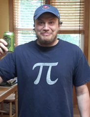

```{r, include=FALSE}
knitr::opts_chunk$set(echo = FALSE, message = FALSE, warning = FALSE, 
                      fig.width = 8, fig.height = 4.5)
```

## How often does the best team win? 


</br></br></br></br></br>

<p class="black">
Michael Lopez, Gregory Matthews, Benjamin Baumer</br>
https://github.com/bigfour/competitiveness
</p>

# An anecdote

## What we remember 


## What we forget


## Pitches in the series


```{r strike-zone, fig.width = 6, fig.height = 4.5}
source("https://raw.githubusercontent.com/bigfour/competitiveness/master/config.R")
temp.df1 <- read.csv(file.path(root, "data", "alcs2013.csv"), stringsAsFactors = FALSE)

xander <- filter(temp.df1, player_name == "Xander Bogaerts", events == "walk", inning == 7)

p <- ggplot(filter(temp.df1, stand == "R"), aes(plate_x, plate_z, colour = strike)) + geom_point() + 
  xlab("Horizontal pitch location") + ylab("Vertical pitch location")  + theme_bw() +
  scale_colour_brewer(type = "qual", "Called a strike?") + 
  ggtitle("Right-handed strike zone", subtitle = "2013 ALCS, Red Sox v. Tigers")  + 
  geom_segment(aes(x=-.8, xend=.8, y=3.4, yend=3.4), linetype=2, colour = "black") + 
  geom_segment(aes(x=-.8, xend=.8, y=1.6, yend=1.6), linetype=2, colour = "black") + 
  geom_segment(aes(x=-.8, xend=-.8, y=1.6, yend=3.4), linetype=2, colour = "black") + 
  geom_segment(aes(x=.8, xend=.8, y=1.6, yend=3.4), linetype=2, colour = "black") 
p
```

## That pitch

```{r strike-zone-plus, fig.width = 6, fig.height = 4.5}
### Note: Using GAMs, 81% chance that Boegarts pitch is called a strike (not accounting for superstar/rookie/home team effects)

library(jpeg); library(grid)
image <- jpeg::readJPEG(file.path(root, "NESSIS2017_files", "xander.jpg"))

p  + geom_point(data = xander, colour = "black", size = 3) + 
  geom_segment(aes(x = 1, xend=xander$plate_x+.05, y=0.3, yend=xander$plate_z - 0.15), 
               arrow = arrow(length = unit(0.2, "cm")), colour = "black") + 
  annotation_custom(rasterGrob(image,  width = unit(1,"npc"), 
                               height = unit(1,"npc")), 
                    xmin = 0.2, xmax = 1.8, ymin = -1, ymax = 0.35)
```

## The truth is...

* About 80% of pitches taken at this location called a strike (using advanced modeling)
* Walk worth about 12% in win expectency ([32% to 44%](http://www.tangotiger.net/welist.html))
* Red Sox were lucky!


## What we also forget


## About that error...

* Jose Iglesias: 98.5% fielding percentage (*Note*: Statcast data unavailable)
* Error worth about 20% in win expectency over out at second ([36% to 56%](http://www.tangotiger.net/welist.html))
* Red Sox were lucky!

## Summary

<div class="double">
> - Two huge swings in win probability that were outside the Red Sox control
> - Red Sox were lucky!

> - 
</div>

# Luck and parity</br>in sports

## Using statistics to assess luck in sports

> * The best team does not always win. Sorry, Detroit

> * How to untangle luck from skill? 

> * How often does the best team win in each sport?  Luck ---> parity


## How to define parity

> the state or condition of being equal

**Google**


## What parity looks like


## What parity does not look like


## Parity checklist

1. Equality at a fixed time 
2. Within season equality 
3. Between season equality

# A cross-sport model 

## Prior work

- Extend [Glickman and Stern, 1998](http://www.tandfonline.com/doi/abs/10.1080/01621459.1998.10474084)


## Challenges 

<div class="double">
> - Problem 1: wins and losses alone insufficient (noisy)
> - Problem 2: point differential non-generalizable
> - Solution: if you can't beat em, use their numbers in a statistical model


</div>


## Moneylines

Team                                  Line ($\ell$)    Probability ($p$)    Normalized
------------------------------------ ---------------  -------------------  ------------
      -127            0.559               0.548
      +117            0.461               0.452
------------------------------------ ---------------  -------------------  ------------

</hr>

$$
  p_i(\ell_i) = \begin{cases}
        \frac{100}{100 + \ell_i} & \text{ if } \ell_i \geq 100 \\
        \frac{|\ell_i|}{100 + |\ell_i|} & \text{ if } \ell_i \leq -100
      \end{cases} \,.
$$

## &nbsp; { .fullpage }

```{r markets-plot}
source("https://raw.githubusercontent.com/bigfour/competitiveness/master/config.R")
load(file.path(data_raw, "bigfour.rda"))
bigfour <- bigfour %>%
  mutate(sport = toupper(sport))
bigfour_summary <- bigfour %>%
  group_by(sport) %>%
  summarize(N = n(), num_seasons = n_distinct(season), 
            earliest = min(gameDate), latest = max(gameDate),
            home_win_pct = sum(home_win, na.rm = TRUE) / n(), 
            prob_missing = sum(is.na(p_home)), 
            prob_pct = sum(!is.na(p_home)) / n(), 
            home_win_prob = mean(p_home, na.rm = TRUE))
bigfour_binned <- bigfour %>%
  mutate(p_home_bin = round(p_home, 2)) %>%
  group_by(sport, p_home_bin) %>%
  summarize(N = n(), home_win_bin_pct = mean(home_win))

markets_plot <- ggplot(data = bigfour, 
                       aes(x = p_home, y = as.numeric(home_win), 
                           color = sport)) + 
  #geom_point(alpha = 0.1) + 
  geom_point(data = bigfour_binned, 
             aes(x = p_home_bin, y = home_win_bin_pct, size = N), alpha = 0.5) + 
  geom_smooth() +
  geom_abline(slope = 1, intercept = 0, color = "black", lty = 2) + 
  geom_hline(data = bigfour_summary, 
             aes(yintercept = home_win_pct, color = sport), lty = 3) + 
  geom_vline(data = bigfour_summary, 
             aes(xintercept = home_win_prob, color = sport), lty = 3) + 
  coord_equal() + 
  scale_x_continuous("Betting Market Estimated Probability of Home Win", 
                     labels = scales::percent, limits = c(0,1)) + 
  scale_y_continuous("Observed Probability of Home Win", 
                     labels = scales::percent, limits = c(0,1)) + 
  scale_color_brewer(palette = "Spectral", name = NULL, guide = FALSE) +
  facet_wrap(~sport)
markets_plot + theme_grey(base_size = 13) 
```

## The model: definitions

* $p_{(q,s,k)ij} =$  probability that team $i$ will beat team $j$ in season $s$ during week $k$ of sports league $q$, for $q \in \{MLB, NBA, NFL, NHL\}$.
* $\alpha_{q_{0}}$ be the league-wide home advantage (HA) in $q$
* $\alpha_{(q) i^{\star}}$ be the extra effect (+ or -) for team $i$ when playing at home
* $\theta_{(q,s,k) i}$ and $\theta_{(q, s, k) j}$ be season-week team strength parameters 


## The model & assumptions

\[ E[\text{logit}(p_{(q,s,k) ij})] = \theta_{(q,s,k) i} - \theta_{(q, s, k) j} + \alpha_{q_0} + \alpha_{(q) i^{\star}} \] 

Assumptions: 

1. $\sum_{i=1}^{t_{q}} \theta_{(q,s,k)i} = 0$
1. $E[\theta_{(i,q,s+1,1)}] = \gamma_{q, season} \theta_{(i, q,s,k)}$
1. $E[\theta_{(i,q,s,k+1)}] = \gamma_{q, week} \theta_{(i, q,s,k)}$
1. $\gamma_{q,week}$ and $\gamma_{q,season}$ week/season level autogressive parameters


## Fitting a cross-sport model

- Data  
    - 2006--2016 reg. season in MLB, NBA, NFL, NHL (Sports Insights)
- Priors
    - Uniform (variance parameters) and Normal (team strength parameters)
- Software
    - `rjags` package in **R** statistical software 
- Draws
    - 20k iterations, 2k burn in, thin of 5

# Results

## &nbsp; {.fullpage}

```{r sox-tigers}
load(file.path(root, "data", "sox.tigers.rda"))
sox.tigers %>% ggplot(aes(x = theta, fill = team)) + 
  geom_density(alpha = 0.5) + ylab("") + xlab("Team Strength (log odds scale)") + 
  scale_fill_manual("", values = c("#BD3039", "#FF6600"), labels = c("Tigers", "Red Sox"), breaks = c("Tigers", "Red Sox")) + 
  labs(title = "Posterior distribution of team strengths", 
       subtitle = "End of 2013 regular season")+  
  theme_grey(base_size = 15)
```


## &nbsp; {.fullpage}

```{r sox-tigers-spaghetti}
load(file.path(root, "data", "tidy_thetas.rda"))
tidy_thetas <- tidy_thetas %>%
  mutate(sport = toupper(sport),
         annotation = "",
         annotation = ifelse(theta == max(theta) & sport == "NFL", 
                             paste0("Strongest (", "Patriots", ")"), 
                             annotation),
         annotation = ifelse(theta < -1.56 & sport == "NFL", 
                             paste0("Weakest (", "Jags", ")"), 
                             annotation))
colors <- tidy_thetas %>%
  select(name, primary, secondary) %>%
  unique()
primary <- colors$primary
secondary <- colors$secondary
names(primary) <- colors$name
names(secondary) <- colors$name
library(teamcolors); library(ggthemes); library(stringi); library(forcats)


###### MLB only
div <- c("AL East", "AL Central", "AL West",
         "NL East", "NL Central", "NL West")
div.teams.MLB <- c(div[6], div[4], div[1], 
               div[1], div[5], div[2],
               div[5], div[6], div[2], 
               div[2], div[3], div[2], 
               div[3], div[6], div[4],
               div[5], div[2], div[4], 
               div[1], div[3], div[4],
               div[5], div[6], div[6], 
               div[3], div[5], div[1], 
               div[3], div[1], div[4])
divisions_mlb <- data_frame(sport = "mlb", division = div.teams.MLB)
divisions_mlb$team <- teamcolors %>%
  filter(sport == "mlb") %>%
  select(name) %>%
  unlist()

divisions <- divisions_mlb
teamcolors <- teamcolors %>%
  left_join(divisions, by = c("sport" = "sport", "name" = "team"))
tidy_thetas_division <- tidy_thetas %>%
  left_join(select(teamcolors, name, division), by = c("name" = "name")) %>%
  mutate(time_val = ifelse(sport == "NFL" | sport == "MLB",  time_val + 1, time_val))


df.2013 <- filter(tidy_thetas_division, sport == "MLB", season == 8)
tigers <- filter(df.2013, name == "Detroit Tigers")
sox <- filter(df.2013, name == "Boston Red Sox")
ggplot(data = df.2013, 
       aes(x = cumweek - 196, y = theta, 
           group = name)) +
  geom_line(alpha = 0.5, colour = "dark grey") + 
  geom_point(size = 0.5, colour = "dark grey") + 
  geom_text(aes(label = annotation), color = "black", hjust = "left", nudge_x = 0.25) + 
  scale_color_manual(name = NULL, values = primary) + 
  scale_fill_manual(name = NULL, values = secondary) + 
  scale_x_continuous(name = "Week of season", lim = c(0, 32)) +
  scale_y_continuous(name = "Team strength (log odds)") + 
  ggtitle("Team Strengths, 2013 MLB ") + 
  guides(color = FALSE, fill = FALSE) +
  geom_line(data = tigers, aes(x = cumweek - 196, y = theta), colour = "#FF6600") + 
  geom_point(data = tigers, aes(x = cumweek - 196, y = theta), colour = "#FF6600") + 
  geom_line(data = sox, aes(x = cumweek - 196, y = theta), colour = "#BD3039") + 
  geom_point(data = sox, aes(x = cumweek - 196, y = theta),  colour = "#BD3039") + 
  annotate("text", x = 28.5, y = .24, colour = "#BD3039", label = "Red Sox", hjust = 0) +  
  annotate("text", x = 28.5, y = .35, colour = "#FF6600", label = "Tigers", hjust = 0) +  
  theme_grey(base_size = 15)
```


## &nbsp; { .fullpage }

```{r full-spaghetti}
spag <- ggplot(data = tidy_thetas_division, 
       aes(x = time_val, y = theta,  group = name)) +
  geom_line(alpha = 0.5) + 
  geom_point(shape = 21, size = 0.5, alpha = 0.8) + 
  #geom_text(aes(label = annotation), color = "black", hjust = "left", nudge_x = 0.25) + 
  #scale_color_manual(name = NULL, values = primary) + 
  #scale_fill_manual(name = NULL, values = secondary) + 
  scale_x_continuous(name = "Season", breaks = 2005:2016) +
  scale_y_continuous(name = "Team Strength (log-odds scale)") + 
  guides(color = FALSE, fill = FALSE) +
  #  guides(color = guide_legend(ncol = 2)) 
  theme_grey(14) + 
  ggtitle("Team strengths across 4 sports leagues")
spag + facet_wrap(~sport, ncol = 1)
```

## &nbsp; { .fullpage }

```{r season-sigma}
load(file.path(root, "data", "params.R1.rda"))
#p.gamma <- ggplot(params, aes(x = gamma_w, y = gamma_s, color = toupper(sport))) + 
#  geom_vline(xintercept = 1, color = "darkgray", linetype = 2) + 
#  annotate("text", x = 1.001, y = 0.85, 
#           label = "Random\nWalk", hjust = "left") + 
#  geom_density_2d() + geom_point(alpha = 0.1) + 
#  xlab(expression(paste("Week-to-week consistency (", gamma[week],")")))+ 
#  ylab(expression(paste("Season-to-season consistency (", gamma[season],")")))+ 
#  scale_colour_brewer(palette = "Dark2", "League") + 
#  theme_grey(base_size = 14) 
#p.gamma

params1 <- params %>% select(-sigma_g, -sigma_w, -sigma_s, -alpha) %>% gather("type", "gamma", gamma_w:gamma_s) 
params1 <- filter(params1, type == "gamma_s" | gamma > 0.9)
library(ggjoy)


p1 <- ggplot(filter(params1, type == "gamma_s"), aes(x = gamma, y = toupper(sport), fill = sport)) + 
  geom_joy() + xlim(c(0.4, 0.8)) + xlab("Less consistent                       More consistent") + ylab("") + 
  ggtitle(expression(paste("Season-to-season evolution of team strength (", gamma[season],")"))) + theme(plot.title = element_text(hjust = 0.5)) + 
  theme_grey(base_size = 12)  + theme(legend.position ="none") 

p1

```


## &nbsp; { .fullpage }


```{r week-sigma}
p2 <- ggplot(filter(params1, type == "gamma_w"), aes(x = gamma, y = toupper(sport), fill = sport)) + 
  geom_joy() + xlim(c(0.96, 1.01)) + xlab("Less consistent                       More consistent") + ylab("") + 
  ggtitle(expression(paste("Week-to-week evolution of team strength (", gamma[week],")"))) + theme(plot.title = element_text(hjust = 0.5)) + 
  theme_grey(base_size = 12)  + theme(legend.position ="none") 

p2
```


## Unpredictability at a fixed point in time


How often does the best team win?
 


## &nbsp; { .fullpage }

```{r home-advantage}
ggplot(params, aes(x = alpha, y = toupper(sport), fill = sport)) + 
  geom_joy() + xlab("Home advantage (log odds scale)") + ylab("") + 
  ggtitle(expression(paste("Home advantage (", alpha[q],")"))) + theme(plot.title = element_text(hjust = 0.5))+ 
  theme_grey(base_size = 12)  + theme(legend.position="none") 
```

## &nbsp; { .fullpage }

```{r home-advantage-nba}
load(file.path(root, "data", "tidy_alphas.R1.rda"))
tidy_alpha_prob <- tidy_alphas %>%
  mutate(alpha_prob = mosaic::ilogit(alpha.team.overall), 
         top_half = alpha_prob < 0.58)
tidy_alpha_summary <- tidy_alpha_prob %>%
  group_by(sport) %>%
  summarize(N = n(), median_ha = median(alpha_prob), max_ha = max(alpha_prob), 
            min_ha = min(alpha_prob)) %>% ungroup() %>% 
  filter(sport == "nba")

gg4 <- ggplot(data = filter(tidy_alpha_prob, sport == "nba"), 
              aes(y = alpha_prob, 
                  x = reorder(team, alpha_prob))) + 
  geom_hline(data = filter(tidy_alpha_summary, sport == "nba"), alpha = 0.5,
             aes(yintercept = median_ha)) + 
  geom_hline(data = filter(tidy_alpha_summary, sport == "nba"), alpha = 0.5,
             aes(yintercept = max_ha)) + 
  geom_hline(data = filter(tidy_alpha_summary, sport == "nba"), alpha = 0.5,
             aes(yintercept = min_ha)) + 
  geom_errorbar(aes(ymin = mosaic::ilogit(alpha.team.lower), 
                    ymax = mosaic::ilogit(alpha.team.upper))) +
  geom_point() + 
  coord_flip() + 
  scale_x_discrete(NULL) + 
  scale_y_continuous("Probability of beating an equal caliber opponent at home", 
                     breaks = c(tidy_alpha_summary$min_ha, tidy_alpha_summary$median_ha, tidy_alpha_summary$max_ha),
                     labels = c(round(tidy_alpha_summary$min_ha, 3),
                                round(tidy_alpha_summary$median_ha, 3),
                                round(tidy_alpha_summary$max_ha, 3)),
                     minor_breaks = NULL) +  
  scale_colour_brewer(palette = "Spectral", "League") +
  ggtitle("Estimated Home Advantage in NBA") +
  theme_gray(12)
gg4
```

# Who cares?

## GMs need to predict the future

<div class="double">


> - Our team strengths are better at predicting future W-L 
</div>

## GMs need to strategize


<div class="double">
> - Patriots rest starters in 2015 against Dolphins
> - Home advantage matters in `r emo::ji("football")` and `r emo::ji("basketball")`


</div>


## GMs need a longe-term plan

> "They have to rethink their whole philosophy"

**Mike Milbury on the 2016 Washington Capitals losing to Pittsburgh**
 

> * There's an immense amount of luck involved in hockey. Rethinking your philosophy on a postseason series is ludicrous


## Acknowledgements: Greg

<p class="double">

</p>

 
## Summary: parity in sports

> - Unpredictability at a fixed time: `r emo::ji("trophy")` (NHL), `r emo::ji("baseball")`
> - Within season unpredictability `r emo::ji("football")`
> - Between season unpredictability `r emo::ji("trophy")` (NHL)
> - Largest home advantage `r emo::ji("basketball")`

More info: 
- Paper (https://arxiv.org/abs/1701.05976) 
- Github (https://github.com/bigfour/competitiveness)

