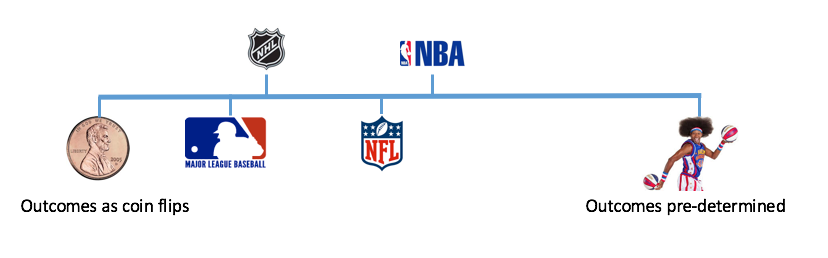

```{r, include=FALSE}
knitr::opts_chunk$set(echo = FALSE, message = FALSE, warning = FALSE, 
                      fig.width = 8, fig.height = 4.5)
knitr::opts_chunk$set(fig.path = 'figures/')
```

## How often does the best team win? 


</br></br></br></br></br></br></br>

<p class="black">
Michael J. Lopez, Gregory J. Matthews, **Benjamin S. Baumer**</br>
http://bit.ly/2gHCI0C</br>
Fields Institute, May 25, 2018
</p>

# 2015 ALDS

## You might remember this...

{.cover}

## You might not remember this...

(https://www.mlb.com/news/elvis-andrus-has-two-key-errors-in-alds-game-5/c-154487546)

## You probably remember this...

{.cover}

# Luck and parity</br>in sports

## Using statistics to assess luck in sports

> * The best team does not always win.

> * How often does the best team win in each sport?  

> * How to untangle luck from skill? 

> * Luck ---> parity


## What parity looks like


## What parity does not look like


## Parity checklist

1. Equality at a fixed time 
2. Postseason tournament
3. Within season equality 
4. Between season equality

# A cross-sport model 

## Prior work

- Extend [Glickman and Stern, 1998](http://www.tandfonline.com/doi/abs/10.1080/01621459.1998.10474084)


## Challenges 

<div class="double">
> - Problem 1: wins and losses alone insufficient (noisy)
> - Problem 2: point differential non-generalizable
> - Solution: if you can't beat 'em, use their numbers in a statistical model


</div>


## &nbsp; { .fullpage }

```{r markets-plot}
source("https://raw.githubusercontent.com/bigfour/competitiveness/master/config.R")
load(file.path(data_raw, "bigfour.rda"))
bigfour <- bigfour %>%
  mutate(sport = toupper(sport))
bigfour_summary <- bigfour %>%
  group_by(sport) %>%
  summarize(N = n(), num_seasons = n_distinct(season), 
            earliest = min(gameDate), latest = max(gameDate),
            home_win_pct = sum(home_win, na.rm = TRUE) / n(), 
            prob_missing = sum(is.na(p_home)), 
            prob_pct = sum(!is.na(p_home)) / n(), 
            home_win_prob = mean(p_home, na.rm = TRUE))
bigfour_binned <- bigfour %>%
  mutate(p_home_bin = round(p_home, 2)) %>%
  group_by(sport, p_home_bin) %>%
  summarize(N = n(), home_win_bin_pct = mean(home_win))

markets_plot <- ggplot(data = bigfour, 
                       aes(x = p_home, y = as.numeric(home_win), 
                           color = sport)) + 
  #geom_point(alpha = 0.1) + 
  geom_point(data = bigfour_binned, 
             aes(x = p_home_bin, y = home_win_bin_pct, size = N), alpha = 0.5) + 
  geom_smooth() +
  geom_abline(slope = 1, intercept = 0, color = "black", lty = 2) + 
  geom_hline(data = bigfour_summary, 
             aes(yintercept = home_win_pct, color = sport), lty = 3) + 
  geom_vline(data = bigfour_summary, 
             aes(xintercept = home_win_prob, color = sport), lty = 3) + 
  coord_equal() + 
  scale_x_continuous("Betting Market Estimated Probability of Home Win", 
                     labels = scales::percent, limits = c(0,1)) + 
  scale_y_continuous("Observed Probability of Home Win", 
                     labels = scales::percent, limits = c(0,1)) + 
  scale_color_brewer(palette = "Spectral", name = NULL, guide = FALSE) +
  facet_wrap(~sport)
markets_plot + theme_grey(base_size = 13) 
```

## The model: definitions

* $p_{(q,s,k)ij} =$  probability that team $i$ will beat team $j$ in season $s$ during week $k$ of sports league $q$, for $q \in \{MLB, NBA, NFL, NHL\}$.
* $\alpha_{q_{0}}$ be the league-wide home advantage (HA) in $q$
* $\alpha_{(q) i^{\star}}$ be the extra effect (+ or -) for team $i$ when playing at home
* $\theta_{(q,s,k) i}$ and $\theta_{(q, s, k) j}$ be season-week team strength parameters 


## The model & assumptions

\[ E[\text{logit}(p_{(q,s,k) ij})] = \theta_{(q,s,k) i} - \theta_{(q, s, k) j} + \alpha_{q_0} + \alpha_{(q) i^{\star}} \] 

Assumptions: 

1. $\sum_{i=1}^{t_{q}} \theta_{(q,s,k)i} = 0$
1. $E[\theta_{(i,q,s+1,1)}] = \gamma_{q, season} \theta_{(i, q,s,k)}$
1. $E[\theta_{(i,q,s,k+1)}] = \gamma_{q, week} \theta_{(i, q,s,k)}$
1. $\gamma_{q,week}$ and $\gamma_{q,season}$ week/season level autogressive parameters


## Fitting a cross-sport model

- Data  
    - 2006--2016 reg. season in MLB, NBA, NFL, NHL (Sports Insights)
- Priors
    - Uniform (variance parameters) and Normal (team strength parameters)
- Software
    - `rjags` package in **R** statistical software 
- Draws
    - 20k iterations, 2k burn in, thin of 5

# Results

## &nbsp; {.fullpage}

```{r sox-tigers}
load(file.path(root, "data", "lateseason2015.RData"))

thetas_end <- thetas.end[2:5, 28:29,,] %>%
  as.vector() %>%
  as_data_frame() %>%
  mutate(team = rep(rep(c("Texas Rangers", "Toronto Blue Jays"), each = 4), 6000)) %>%
  rename(theta = value)
  


library(teamcolors)
these_colors <- teamcolors %>%
  filter(name %in% c("Texas Rangers", "Toronto Blue Jays"))

thetas_end %>% 
  ggplot(aes(x = theta, fill = team)) + 
    geom_density(alpha = 0.5) + ylab("") + 
    xlab("Team Strength (log odds scale)") + 
    scale_fill_manual("", values = these_colors$primary) + 
    labs(title = "Posterior distribution of team strengths", 
         subtitle = "End of 2015 regular season")+  
    theme_grey(base_size = 15)
```


## &nbsp; {.fullpage}

```{r sox-tigers-spaghetti}
load(file.path(root, "data", "tidy_thetas.rda"))
tidy_thetas <- tidy_thetas %>%
  mutate(sport = toupper(sport),
         annotation = "",
         annotation = ifelse(theta == max(theta) & sport == "NFL", 
                             paste0("Strongest (", "Patriots", ")"), 
                             annotation),
         annotation = ifelse(theta < -1.56 & sport == "NFL", 
                             paste0("Weakest (", "Jags", ")"), 
                             annotation))
colors <- tidy_thetas %>%
  select(name, primary, secondary) %>%
  unique()
primary <- colors$primary
secondary <- colors$secondary
names(primary) <- colors$name
names(secondary) <- colors$name
library(teamcolors); library(ggthemes); library(stringi); library(forcats)

tm_colors <- teamcolors %>%
  mutate(name = case_when(
#    name == "Los Angeles Angels of Anaheim" ~ "Los Angeles Angels",
    name == "St. Louis Cardinals" ~ "St Louis Cardinals",
    name == "Los Angeles Chargers" ~ "San Diego Chargers",
    TRUE ~ name
  )) %>%
  select(name, division)

tidy_thetas_division <- tidy_thetas %>%
  left_join(tm_colors, by = c("name" = "name")) %>%
  mutate(time_val = ifelse(sport == "NFL" | sport == "MLB", 
                           time_val + 1, time_val))
max.theta <- round(max(tidy_thetas_division$theta), 2)
min.theta <- round(min(tidy_thetas_division$theta), 2)


theta_year <- tidy_thetas_division %>%
  filter(sport == "MLB", season == 10)
highlight <- theta_year %>%
  filter(name %in% c("Texas Rangers", "Toronto Blue Jays"))
highlight_names <- highlight %>%
  group_by(name) %>%
  summarize(end_theta = max(theta))
ggplot(data = theta_year, 
       aes(x = week, y = theta, 
           group = name)) +
  geom_line(alpha = 0.5, colour = "dark grey") + 
  geom_point(size = 0.5, colour = "dark grey") + 
  geom_text(aes(label = annotation), color = "black", hjust = "left", nudge_x = 0.25) + 
  scale_color_manual(name = NULL, values = primary) + 
  scale_fill_manual(name = NULL, values = secondary) + 
  scale_x_continuous(name = "Week of season", lim = c(0, 33)) +
  scale_y_continuous(name = "Team strength (log odds)") + 
  ggtitle(paste("Team Strengths,", max(theta_year$season) + 2005, "MLB ")) + 
  guides(color = FALSE, fill = FALSE) +
  geom_line(data = highlight, aes(color = name)) + 
  geom_point(data = highlight, aes(fill = name)) +
  geom_text(data = highlight_names, x = 28.5, aes(label = name, y = end_theta), hjust = 0) +   
  theme_grey(base_size = 15)
```


## &nbsp; { .fullpage }

```{r full-spaghetti}
spag <- ggplot(data = tidy_thetas_division, 
       aes(x = time_val, y = theta,  group = name)) +
  geom_line(alpha = 0.1) + 
  geom_point(shape = 21, size = 0.5, alpha = 0.2) + 
  #geom_text(aes(label = annotation), color = "black", hjust = "left", nudge_x = 0.25) + 
  #scale_color_manual(name = NULL, values = primary) + 
  #scale_fill_manual(name = NULL, values = secondary) + 
  scale_x_continuous(name = "Season", breaks = 2005:2016) +
  scale_y_continuous(name = "Team Strength (log-odds scale)") + 
  guides(color = FALSE, fill = FALSE) +
  #  guides(color = guide_legend(ncol = 2)) 
  theme_grey(14) + 
  ggtitle("Team strengths across 4 sports leagues")
spag + facet_wrap(~sport, ncol = 1)
```

## &nbsp; { .fullpage }

```{r season-sigma}
load(file.path(root, "data", "params.R1.rda"))
#p.gamma <- ggplot(params, aes(x = gamma_w, y = gamma_s, color = toupper(sport))) + 
#  geom_vline(xintercept = 1, color = "darkgray", linetype = 2) + 
#  annotate("text", x = 1.001, y = 0.85, 
#           label = "Random\nWalk", hjust = "left") + 
#  geom_density_2d() + geom_point(alpha = 0.1) + 
#  xlab(expression(paste("Week-to-week consistency (", gamma[week],")")))+ 
#  ylab(expression(paste("Season-to-season consistency (", gamma[season],")")))+ 
#  scale_colour_brewer(palette = "Dark2", "League") + 
#  theme_grey(base_size = 14) 
#p.gamma

params1 <- params %>% select(-sigma_g, -sigma_w, -sigma_s, -alpha) %>% gather("type", "gamma", gamma_w:gamma_s) 
params1 <- filter(params1, type == "gamma_s" | gamma > 0.9)
library(ggjoy)


p1 <- ggplot(filter(params1, type == "gamma_s"), aes(x = gamma, y = toupper(sport), fill = sport)) + 
  geom_joy() + xlim(c(0.4, 0.8)) + xlab("Less consistent                       More consistent") + ylab("") + 
  ggtitle(expression(paste("Season-to-season evolution of team strength (", gamma[season],")"))) + theme(plot.title = element_text(hjust = 0.5)) + 
  theme_grey(base_size = 12)  + theme(legend.position ="none") 

p1

```


## &nbsp; { .fullpage }


```{r week-sigma}
p2 <- ggplot(filter(params1, type == "gamma_w"), aes(x = gamma, y = toupper(sport), fill = sport)) + 
  geom_joy() + xlim(c(0.96, 1.01)) + xlab("Less consistent                       More consistent") + ylab("") + 
  ggtitle(expression(paste("Week-to-week evolution of team strength (", gamma[week],")"))) + theme(plot.title = element_text(hjust = 0.5)) + 
  theme_grey(base_size = 12)  + theme(legend.position ="none") 

p2
```


## Unpredictability at a fixed point in time


How often does the best team win?
 


## &nbsp; { .fullpage }

```{r playoff-sims}
load(file.path(root, "data", "res.rda"))
res_grouped <- res %>%
  group_by(sport, seed) %>%
  summarize(mean_finish = mean(finish)) %>%
  mutate(predestination_finish = ceiling(log2(seed)) + 1)

parity <- res_grouped %>%
  summarize(parity_finish = mean(predestination_finish)) 

res_grouped <- res_grouped %>%
  inner_join(parity, by = "sport") %>%
  mutate(SSM = (mean_finish - parity_finish)^2,
         SST = (predestination_finish - parity_finish)^2,
         weight = 17 - seed)

labels <- parity %>%
  # hack for labels
  mutate(seed = 16, mean_finish = 4, label = "perfect parity")

labels2 <- labels %>%
  mutate(seed = 1.5, mean_finish = 1, label = "predestination")

r_squared <- res_grouped %>%
  group_by(sport) %>%
  summarize(r_squared = sum(SSM) / sum(SST),
            weighted_r_squared = sum(weight * SSM) / sum(weight * SST))

res_tile <- res %>%
  group_by(sport, seed, finish) %>%
  summarize(N = n())

ggplot(res_grouped, aes(x = seed, y = mean_finish, color = toupper(sport))) + 
  geom_tile(data = res_tile, aes(y = finish, fill = N), color = NA) + 
#  geom_point(aes(y = predestination_finish), color = "darkgray") + 
  geom_line(aes(y = predestination_finish), color = "black", linetype = 3) +
#  geom_point(aes(y = parity_finish), color = "darkgray") + 
  geom_line(aes(y = parity_finish), color = "black", linetype = 3) +
  geom_point() + 
  geom_line() +
#  geom_jitter(alpha = 0.007) + 
  geom_smooth(se = FALSE) + 
  geom_text(data = labels, aes(label = label), color = "black", vjust = "top", hjust = "right", size = 3) + 
  geom_text(data = labels2, aes(label = label), color = "black", hjust = "left", size = 3) + 
  geom_text(data = r_squared, x = 15, y = 1, 
            aes(label = paste("~R^2 =\n", round(r_squared, 3)))) + 
#  geom_curve(x = 15, y = 3.5, xend = 16, yend = 4.0625, arrow = arrow(length = unit(0.1, "cm"))) + 
  scale_fill_gradient(low = "gray92", high = "darkgray") + 
  scale_color_brewer("League", palette = "Spectral") +
  scale_x_continuous("Tournament Seed", breaks = 2^(0:4), expand = c(0.01, 0.01)) +
  scale_y_continuous("Tournament Finish (round)", expand = c(0.01, 0.01)) + 
  facet_wrap(~toupper(sport)) + 
  ggtitle("Simulated 16-Team Tournaments, 2004-2016")
```

## &nbsp; { .fullpage }

```{r playoff-series}
load(file.path(root, "data", "how_long.rda"))
how_long_16 <- how_long %>%
  filter(num_teams == 16)
y_breaks <- how_long %>%
  filter(actual == TRUE) %>%
  pull(r_squared) %>%
  append(seq(0, 1, by = 0.25)) %>%
  round(3)
ggplot(how_long, aes(x = series_length, y = r_squared, color = toupper(sport))) + 
  geom_hline(yintercept = pull(filter(how_long, sport == "nba" & series_length == 7 & num_teams == 16), r_squared), color = "darkgray", linetype = 2) + 
  geom_point(aes(size = actual)) + 
#  geom_line() + 
  geom_smooth(se = FALSE) + 
  ggtitle("Equivalence of Playoff Series Length", 
          subtitle = "Simulated 8-Team and 16-Team Tournaments") + 
  scale_y_continuous(expression(Pseudo-R^2), breaks = y_breaks, minor_breaks = NULL) + 
  scale_x_continuous("Length of Series (each round)", breaks = sort(unique(how_long$series_length))) + 
  scale_size_discrete("Actual") + 
  scale_shape_discrete("Teams") + scale_linetype_discrete("Teams") + 
  scale_color_brewer("League", palette = "Spectral") + 
  facet_wrap(~num_teams)
```

## &nbsp; { .fullpage }

```{r home-advantage}
ggplot(params, aes(x = alpha, y = toupper(sport), fill = sport)) + 
  geom_joy() + xlab("Home advantage (log odds scale)") + ylab("") + 
  ggtitle(expression(paste("Home advantage (", alpha[q],")"))) + theme(plot.title = element_text(hjust = 0.5))+ 
  theme_grey(base_size = 12)  + theme(legend.position="none") 
```

## &nbsp; { .fullpage }

```{r home-advantage-nba}
load(file.path(root, "data", "tidy_alphas.R1.rda"))
tidy_alpha_prob <- tidy_alphas %>%
  mutate(alpha_prob = mosaic::ilogit(alpha.team.overall), 
         top_half = alpha_prob < 0.58)
tidy_alpha_summary <- tidy_alpha_prob %>%
  group_by(sport) %>%
  summarize(N = n(), median_ha = median(alpha_prob), max_ha = max(alpha_prob), 
            min_ha = min(alpha_prob)) %>% ungroup() %>% 
  filter(sport == "nba")

gg4 <- ggplot(data = filter(tidy_alpha_prob, sport == "nba"), 
              aes(y = alpha_prob, 
                  x = reorder(team, alpha_prob))) + 
  geom_hline(data = filter(tidy_alpha_summary, sport == "nba"), alpha = 0.5,
             aes(yintercept = median_ha)) + 
  geom_hline(data = filter(tidy_alpha_summary, sport == "nba"), alpha = 0.5,
             aes(yintercept = max_ha)) + 
  geom_hline(data = filter(tidy_alpha_summary, sport == "nba"), alpha = 0.5,
             aes(yintercept = min_ha)) + 
  geom_errorbar(aes(ymin = mosaic::ilogit(alpha.team.lower), 
                    ymax = mosaic::ilogit(alpha.team.upper))) +
  geom_point() + 
  coord_flip() + 
  scale_x_discrete(NULL) + 
  scale_y_continuous("Probability of beating an equal caliber opponent at home", 
                     breaks = c(tidy_alpha_summary$min_ha, tidy_alpha_summary$median_ha, tidy_alpha_summary$max_ha),
                     labels = c(round(tidy_alpha_summary$min_ha, 3),
                                round(tidy_alpha_summary$median_ha, 3),
                                round(tidy_alpha_summary$max_ha, 3)),
                     minor_breaks = NULL) +  
  scale_colour_brewer(palette = "Spectral", "League") +
  ggtitle("Estimated Home Advantage in NBA") +
  theme_gray(12)
gg4
```

# Who cares?

## GMs need to predict the future

<div class="double">


> - Buyers or sellers at trade deadline?
> - Our team strengths are better at predicting future W-L 
</div>

## GMs need to strategize


<div class="double">
> - Patriots rest starters in 2015 against Dolphins
> - Lost HFA, lost in Denver
> - Home advantage matters in `r emo::ji("football")` and `r emo::ji("basketball")`


</div>


## GMs need a longe-term plan

> "They have to rethink their whole philosophy"

**Mike Milbury on the 2016 Washington Capitals losing to Pittsburgh**
 

> * There's an immense amount of luck involved in hockey. Rethinking your philosophy on a postseason series is ludicrous


## Acknowledgements: Greg & Mike

<div class="double">
{.one-col-image}

</br></br>

{.one-col-image}
</div>

 
## Parity in sports

<div class="double">
More info: 

- Paper (https://arxiv.org/abs/1701.05976) 
    - *Annals of Applied Statistics*
- Code (https://github.com/bigfour/competitiveness)
- Slides (http://bit.ly/2gHCI0C)
</br></br></br></br>


Summary:

> - Unpredictability at a fixed time: `r emo::ji("hockey")`, `r emo::ji("baseball")`
> - Within season unpredictability: `r emo::ji("football")`, `r emo::ji("basketball")`
> - Between season unpredictability: `r emo::ji("hockey")` 
> - Largest home advantage: `r emo::ji("basketball")`
</div>

# Thank you!!

